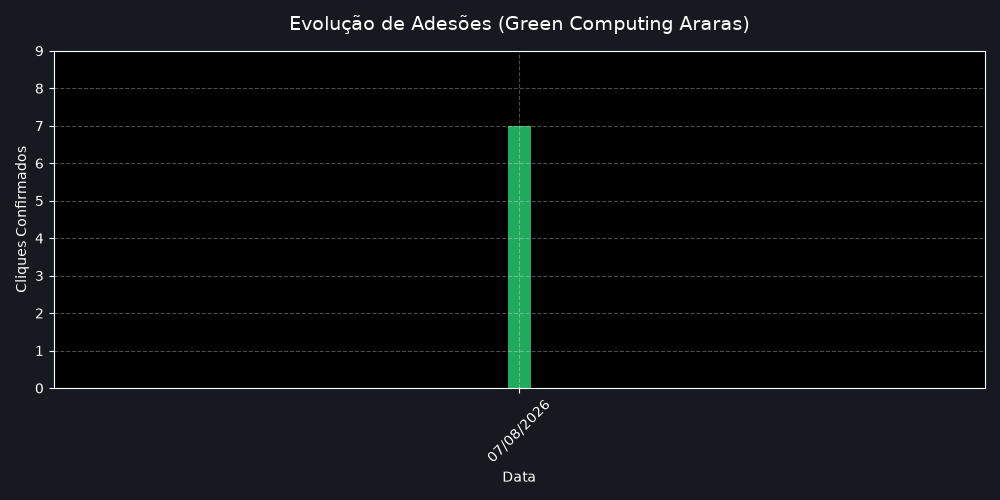

# Green Computing: Sobriedade Digital no Recanto das Araras

[](https://brasil.un.org/pt-br/sdgs/6)
[](https://brasil.un.org/pt-br/sdgs/7)
[](LICENSE)
[]()

## 📌 Sobre o Projeto
Projeto de atividade extensionista universitária (UFBRA) focado na aplicação de **Lean ICT** e **Green Computing** na comunidade do **Residencial Recanto das Araras I e II** (Palmas/TO), realizado em parceria estratégica com o **COMAM** (Conselho Municipal das Associações de Moradores).

O objetivo principal é promover o letramento digital focado na estagnação do desperdício financeiro familiar com pacotes de dados móveis e na mitigação da obsolescência acelerada de smartphones (lixo eletrônico).

### 🌿 Alinhamento com os ODS (ONU)
A otimização de software no dispositivo do usuário final (*Edge*) reduz o tráfego de dados inútil (anúncios, telemetria e mídias automáticas), gerando impacto ambiental na infraestrutura global:
* **ODS 7 (Energia Limpa):** Redução da demanda elétrica nas antenas de transmissão 4G/5G e roteadores.
* **ODS 6 (Água Potável):** Redução do processamento na nuvem, diminuindo a evaporação de água potável necessária no resfriamento (*WUE - Water Usage Effectiveness*) dos Data Centers.

---

<!-- TELEMETRY_START -->
📊 **Telemetria de Impacto:** 7 adesões confirmadas via Short.io (Atualizado em 07/08/2026 às 09:21)
<!-- TELEMETRY_END -->

## 📈 Histórico de Adesão
O gráfico abaixo é atualizado automaticamente via GitHub Actions a cada nova confirmação de leitura e aplicação das dicas pela comunidade.



---

## 🚀 Artefatos Entregues

1. **Micro-Cartilha de Sobriedade Digital (PDF 9:16):**
   - Guia prático de 8 páginas otimizado para telas de smartphones (proporção 9:16).
   - Tipografado em LaTeX com o Tema Nord, fonte Roboto e pacote `microtype`.
   - Cobertura de 4 pilares: DNS Privado (AdGuard Family), Economia de Dados Global, Restrição de Apps em 2º Plano e Desativação de Autoplay no WhatsApp.
2. **Cartaz Promocional de Divulgação (PNG):**
   - Arte de engajamento em 1080x1080px (desenvolvida no Inkscape) para acompanhamento da cartilha no WhatsApp.
3. **Sistema de Telemetria e Feedback:**
   - Integração com **Short.io** + **QR Code** apontando para um endpoint estático de confirmação hospedado no GitHub (`assets/ok_registrado.png`), mensurando a taxa de adoção da comunidade sem coletar dados sensíveis dos moradores.

---

## 📁 Estrutura do Repositório

```text
green-computing-araras/
├── .github/
│   └── workflows/
│       └── telemetry.yml        # Automação CI/CD (GitHub Actions)
├── assets/
│   ├── araras_poly.png          # Arte de capa (Arara Low Poly)
│   ├── cartaz_sobriedade_diginal.png
│   ├── ok_registrado.png        # Endpoint estático de confirmação (Short.io)
│   ├── qr_araras-ok.png         # QR Code do Short.io
│   ├── telemetry_chart.png      # Gráfico gerado dinamicamente
│   ├── telemetry_history.csv    # Banco de dados histórico de cliques
│   └── screenshots/             # Prints reais do Android/WhatsApp
├── dist/
│   └── main.pdf                 # Compilado final da cartilha
├── scripts/
│   └── fetch_telemetry.py       # Script de extração de dados da API
├── src/
│   ├── inkscape/                # Fontes vetoriais (.svg)
│   └── latex/                   # Código-fonte TeX, macros e estilos
│       └── main.tex
├── .gitignore
├── LICENSE
└── README.md
```
---

## 🛠️ Tecnologias e Ferramentas

* **Tipografia e Diagramação:** LaTeX (`pdflatex`), pacotes `tcolorbox`, `microtype`, `roboto`, `graphbox`, `hyperref`.
* **Design Gráfico e UI:** Inkscape, GIMP, DALL-E 3 (conceito Low Poly).
* **Captura de Tela e Usabilidade:** `scrcpy` (espelhamento Android em alta fidelidade).
* **Rastreamento e Telemetria:** Short.io, GitHub Raw Endpoints.

---

## 💻 Como Compilar o PDF Localmente

Para compilar o projeto em seu ambiente local (requer distribuição LaTeX como MiKTeX ou TeX Live):

```bash
cd src/latex
pdflatex main.tex
```

---

## 🤝 Agradecimentos
Agradecimento especial à **Associação de Moradores do Recanto das Araras I e II** e à vice-presidente do **COMAM (Carolina)** pela cooperação no processo de validação de requisitos, usabilidade e distribuição na comunidade.

---
**Autor:** @naygno — *Acadêmico de Ciência da Computação (UFBRA)*
